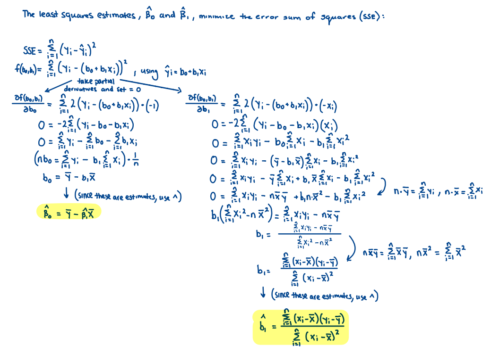

```{r setup, include=FALSE, warning = FALSE}
knitr::opts_chunk$set(echo = TRUE)
```

## Load libraries

**Load 'class', 'ISLR', 'knitr', and 'dplyr' libraries, and set seed to '4'**

```{r, include = FALSE}
library(class)
library(ISLR)
library(dplyr)
library(knitr)

set.seed(4)
```

## Question 1

{width=50%, height=50%}

## Question 2

```{r}
# Load dataframe
load("Homeworks/Data/Problem2.dat")

x1 <- data$x1
x2 <- data$x2
xrandom <- data$xrandom
y <- data$y
```

### a) Treat the first 500 subjects as training, the remaining 500 as test data.

```{r}
# Create training data
df_Q2 <- data.frame(x1, x2)
train_Q2 <- df_Q2[1:500,]
test_Q2 <- df_Q2[501:1000,]
```

**i) If we use the Bayes classifier using the knownprobability above, do we expect the error rates to be different between the training and test data sets?**

If we use the known probability, it is expected that the error rates will be similar for the training and test data sets. The difference in error rates arises from our estimated conditional probability. However, since we have the true probability density, we should expect the Bayes classifier to perform the same, in terms of error rate, between the testing and training data sets.

**ii) Use the Bayes classifier to find the error rate for the training data and for the test data.**

It is important to note that the test error rate is marginally smaller than that of the training set (~0.0023). Given how we split the dataset (50%, not at random), this difference can be attributed to chance.

```{r}
# Apply the cdf to training and testing datasets
train <- pnorm(0.5*train_Q2$x1 - 0.4*train_Q2$x2)
test <- pnorm(0.5*test_Q2$x1 - 0.4*test_Q2$x2)

# Want the probability of finding Y=1, so if we get a probability less than 0.5 (which indicates Y=0), we flip it to the probability of NOT getting Y=0, which is 1-P()
train <- case_when(train < 0.5 ~ (1-train),
                   TRUE ~ train)
test <- case_when(test < 0.5 ~ (1-test),
                   TRUE ~ test)

# Find the average Bayes error rate
avg_bayes_train <- 1 - (sum(train) / length(train))
avg_bayes_test <- 1 - (sum(test) / length(test))

# Print values
bayes_out <- cbind(avg_bayes_train, avg_bayes_test)
colnames(bayes_out) <- c("Training Error", "Testing Error")
kable(bayes_out, digits = 4, align = "l")
```

**iii) Use K-nearest neighbors with k = 3 to classify the outcomes in the test data set. What is the test error rate now?**

```{r, results = 'asis'}
# Generate outcome labels
train_labels_Q2 <- y[1:500]
test_labels_Q2 <- y[501:1000]

# Run KNN with k=3 and assess model accuracy 
knn_pred_Q2 <- knn(train = train_Q2, test = test_Q2, cl = train_labels_Q2, k = 3)
error_Q2 <- 1 - (sum(test_labels_Q2 == knn_pred_Q2) / NROW(test_labels_Q2))

cat('The error rate is', error_Q2)
```

**iv) Given the test error rate in the previous part, and the error rates found in part (i), do you think that k = 3 is the best choice of k? Why or why not?**

Based on the error rate of KNN, 0.386, using k = 3 is not the best choice of k. The error rate produced by using k = 3 is 0.0675 greater than the testing rate found in part (ii). This is a substantial margin (~6%), so in order to improve our estimate, we want to test different values for k.

**v) Create a plot that shows the test error rate as a function of k. What do you think is the best choice of k?**

Initially, the error rate starts around 0.44. As we increase the value of k, the error rate drops. Eventually, around k = 25, the error rate begins to level out at between 0.32 and 0.34. The error rate, on the k-value interval [1,50], is at a minimum at k=45 (~0.32). Thus, based on this plot, a k-value of 45 would produce the lowest error rate, which is also the closest testing error rate to that found by the Bayes classifier in part (ii). 

```{r}
# Run KNN and assess model accuracy, creating a plot with error rate as a function of k
k_optimal_plot <- 1
for(i in 1:50){
  knn_pred_plot <- knn(train = train_Q2, test = test_Q2, cl = train_labels_Q2, k = i)
  k_optimal_plot[i] <- 1 - (sum(test_labels_Q2 == knn_pred_plot) / NROW(test_labels_Q2))
}

plot(k_optimal_plot, type = 'b', main = "Error rate at different values of k", xlab = "k-value", ylab = "Error Rate")
```

**vi) Do you think that KNN does a good job at approximating the Bayes classifier in this data set? Why or why not?**

As the value of k increases, the error rate of KNN approaches ~0.32 (32%). Using the Bayes classifier in part (ii), we calculated a test error rate of 0.3185 (31.85%), a difference of ~0.0015. Since the error rate of KNN approaches a margin of difference that is so small, we can say that KNN does a good job in approximating the Bayes classifier for this dataset.

**vii) Now suppose that we have 20 additional covariates which are not predictive of Y. These are saved in the data file as xrandom. Use the KNN method with k = 40, but use the original two predictors as well as the additional 20 predictors. What is the test set error rate?**

```{r, results = 'asis'}
# Create training data, now with 2 original predictors and 20 xrandom predictors
df_Q2_xrand <- data.frame(x1, x2, xrandom)

train_Q2_xrand <- df_Q2_xrand[1:500,]
test_Q2_xrand <- df_Q2_xrand[501:1000,]

# Generate outcome labels
train_labels_Q2_xrand <- y[1:500]
test_labels_Q2_xrand <- y[501:1000]

# Run KNN with k=40 and assess model accuracy 
knn_pred_Q2_xrand <- knn(train = train_Q2_xrand, test = test_Q2_xrand, cl = train_labels_Q2_xrand, k = 40)
error_Q2_xrand <- 1 - (sum(test_labels_Q2_xrand == knn_pred_Q2_xrand) / NROW(test_labels_Q2_xrand))

cat('The error rate is', error_Q2_xrand)
```

**viii) What does the previous part tell you about KNN?**

KNN is susceptible to the influence of noise, which results from the randomness of the new predictors. While the good predictors are present, their effectiveness is suppressed, resulting in an inflated error rate. When utilizing the KNN method, we must be careful with random noise, as well as outliers and mislabeled data. Failing to do so will result in less accurate classification.

## Question 3

```{r}
# Load data set
data(Smarket)
n <- length(Smarket$Today)

# Look at data
head(Smarket)
```

### a) Fit a linear regression model that aims to predict Today (daily return in the stock market) using lags 1-5, Year, and Volume.

**i) How did you include Year into the model and why?**

Year was included in the model as a dummy variable, or as a factor. The 'Year' variable is categorical, so we cannot treat it as though it is quantitative. We cannot assign 2004 '1' and 2005 '2', because this implies that 2005 is twice the value of 2004, which does not make sense in the context of the problem. Instead, we use a dummy variable for Year, which will create factor levels  with 2001 as a baseline reference value. Then, we can use the years as predictor variables (in addition to lags 1-5 and Volume). 

```{r}
# Fit model using Lags 1-5, Volume, and Year as a dummy variable - 2001 is the reference
lm_mod_linear <- lm(Today ~ . - Direction - Year + as.factor(Year), 
          data=Smarket)
summary(lm_mod_linear)
```

**ii) Run an F-test to determine if the covariates are predictive of the outcome. Your answer should include a test statistic, p-value, and decision regarding a hypothesis test.**

H0: β1 = β2 = ... = β10 = 0
Ha: At least one coefficient is nonzero.

F-statistic: 0.7757
P-value: 0.6525

Since the p-value, 0.6525, is greater than 0.05, we fail to reject the null hypothesis at the 0.05 significance level. Thus, we cannot determine if the covariates are predictive of the outcome. 

```{r}
# Run anova on the model
anov <- aov(lm_mod_linear)
summary(anov)
  
# Calculate TSS and RSS
TSS <- sum((Smarket$Today - mean(Smarket$Today))^2)
RSS_linear <- sum((Smarket$Today - lm_mod_linear$fitted.values)^2)
p_linear <- length(coef(lm_mod_linear)) - 1
n <- length(Smarket$Today)

# Store p-value and F-statistic
fstat <- ((TSS - RSS_linear) / p_linear) / (RSS_linear / (n - p_linear - 1))
pval <- pf(fstat, p_linear, n-p_linear-1, lower.tail = FALSE)

# Print values
ftest_out <- cbind(fstat, pval)
colnames(ftest_out) <- c("F-Stat", "p-value")
kable(ftest_out, digits = 4, align = "l")
```

**iii) Fit a model on the same covariates, but now include lag 1 in the model with a three degree of freedom polynomial. Run a test to see if this model fits the data better than the previous model, which only included lag 1 linearly.**

H0: β10 = β11 = ... = β14 = 0
Ha: At least one coefficient in the new model is nonzero.

F-statistic: 0.0502
P-value: 0.951

Since the p-value, 0.951, is greater than 0.05, we fail to reject the null hypothesis at the 0.05 significance level. Thus, we cannot conclude that the more complex model (the model that uses lag 1 with a three degree of freedom polynomial) fits the data statistically better than the simpler model (the model that uses lag 1 linearly).

```{r}
# Fit model using Lags 1-5, Volume, and Year as a dummy variable - 2001 is the reference
lm_mod_poly <- lm(Today ~ . - Lag1 - Direction - Year + as.factor(Year) + poly(Lag1, 2) + poly(Lag1, 3),
                   data=Smarket)
#summary(lm_mod_poly)

anov <- anova(lm_mod_linear, lm_mod_poly)
fstat_comp <- anov[2,5]
pval_comp <- anov[2,6]

# Calculations by hand - not needed due to anova table
#p_poly <- length(coef(lm_mod_poly)) - 1

# Conduct the f-test to compare the models
#RSS_poly <- sum((Smarket$Today - lm_mod_poly$fitted.values)^2)

#df_linear <- n-p_linear-1
#df_poly <- n-p_poly-1

#fstat_comp <- ((RSS_linear - RSS_poly) / (df_linear - df_poly)) / (RSS_poly / df_poly)
#pval_comp <- pf(fstat_comp, df_linear - df_poly, df_poly, lower.tail = FALSE)

# Print values
ftest_comp_out <- cbind(fstat_comp, pval_comp)
colnames(ftest_comp_out) <- c("F-Stat", "p-value")
kable(ftest_comp_out, digits = 4, align = "l")
```

### b) Now we will use the same predictors, but the outcome is the binary variable Direction, which indicates whether the stock market went up or down that day.

**i) Randomly select half of the data to be your training set, and half to be your test set. Use KNN to predict the outcome on the test data and find the smallest test set error you can achieve.**

```{r}
# Create training data using random days - this is to account for the effect of year-to-year changes in the stock market
attach(Smarket)
knn_data <- data.frame(Lag1, Lag2, Lag3, Lag4, Lag5, Volume, Year)

trainIndex <- sample(1:nrow(knn_data), floor(n / 2), replace=FALSE)

SmarketTrain <- knn_data[trainIndex,]
SmarketTest <- knn_data[-trainIndex,]

SmarketTrain_labels <- Smarket$Direction[trainIndex]
SmarketTest_labels <- Smarket$Direction[-trainIndex]

# Run KNN and assess model accuracy - range 1:30 because the square root of the total observations is 25, and using 30 gives an extra buffer
k_optimal <- 1
for(i in 1:30){
  knn_pred <- knn(train = SmarketTrain, test = SmarketTest, cl = SmarketTrain_labels, k = i)
  k_optimal[i] <- 1 - (sum(SmarketTest_labels == knn_pred) / NROW(SmarketTest_labels))
  k_val <- i
  cat(k_val, '=', k_optimal[i], '\n')
}
```

```{r, results = 'asis'}
best_error <- min(k_optimal)
cat('The lowest error rate is', best_error)
```


**ii) Does the above result tell you anything about how predictive the covariates are of the outcome?**

The result, with a minimum error rate of 0.464, is not sufficient to assess the predictability of the covariates. The error rate fluctuates just below 0.5, which is very high if we wish to use KNN to determine the predictability of the covariates with any confidence. 

## Question 4

**i) I want to create a confidence interval for the average value of the outcome among subjects with X = x0 as well as a prediction interval for a randomly chosen individual with X = x0. Are these two confidence intervals the same? If yes, explain why. If no, explain why not and how they differ.**

These two confidence intervals are different. More specifically, there is a difference in the properties of the error for each interval. The average value of outcome for X = x0 is given by Xnew * β, while a prediction for subject X = x0 is given by Xnew * β + ε. Regardless of the size of the dataset, there is no way to reduce the variance of ε (Var(ε) = σ^2). Because the error of prediction intervals is irreducible, confidence intervals for prediction are wider than those for averages. 

**ii) Do the widths of the two confidence intervals described in part (i) go to zero as n → ∞? Explain why or why not.**

The width of the confidence interval for the average value of outcome approaches zero as n, the sample size, approaches infinity. A larger sample size (lower variability in the data) will result in a tighter interval and smaller error. The interval will eventually collapse to a single value: the true population mean. Conversely, the prediction interval will not converge to a single value as sample size approaches infinity, and thus the width of the prediction interval will not approach 0 as n increases. This can be seen in the right-hand side of the prediction interval equation, sqrt(1 + 1/n), which does not converge to 0 itself.