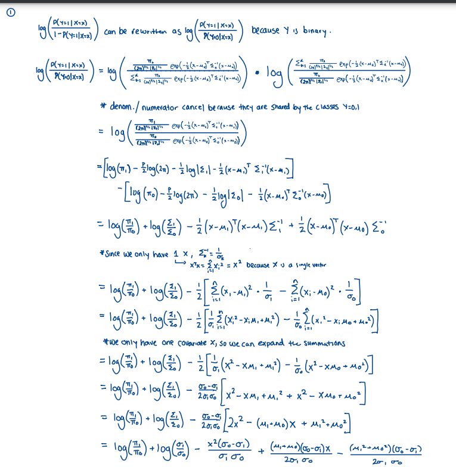
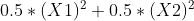

```{r setup, include=FALSE, warning = FALSE}
knitr::opts_chunk$set(warning = FALSE, echo = TRUE)
```

**Load 'tidyverse', 'ggplot2', 'gridExtra', 'MASS', 'knitr', and 'reshape2' libraries, and set seed to '4'**

```{r, include = FALSE}
# Load libraries
library(tidyverse)
library(ggplot2)
library(gridExtra)
library(MASS)
library(knitr)
library(reshape2)

set.seed(4)
```

## Question 1

{width=40%, height=100%}

{width=70%, height=50%}

## Question 2

```{r}
# Read in data
q2 <- read.csv("Data/HW2Problem2.csv")
q2_data <- data.frame(q2)
q2_X1 <- q2_data$X1
q2_X2 <- q2_data$X2
q2_Y <- q2_data$Y
q2_n <- length(q2_Y)
```

**i. For each of the four approaches, produce a plot that highlights the boundary region that separates the two classes. It should look something like the following, where green denotes areas that we would classify as Y = 1 and blue denotes Y = 0.**

```{r}
# Create grid of points for plots
gridX1 <- seq(-3, 3, length=100)
gridX2 <- seq(-3, 3, length=100)
gridX <- expand.grid(gridX1, gridX2)
plot_data <- data.frame(gridX)
colnames(plot_data) <- c('X1','X2')
```

1. Logistic regression with linear terms for the covariates

```{r}
# Fit a logistic model with linear covariates
q2_logit_linear <- glm(Y ~ X1 + X2, 
                      family = binomial, 
                      data = q2_data)
q2_linear_pred <- 1*(predict(q2_logit_linear, 
                                           plot_data, 
                            type = "response") > 0.5)

q2_plot_linear <- plot_data %>% 
  ggplot(aes(x = X1, y = X2, color = as.factor(q2_linear_pred))) +
  geom_point() + 
  scale_colour_manual(values=c("blue", "darkgreen")) +
  labs(title = "Logsitic Regression", 
       x = "X1",
       y = "X2",
       color = "Outcome")
```

2. Logistic regression that includes linear and squared terms for X1 and X2

```{r}
# Fit a logistic model with quadratic covariates
q2_logit_poly <- glm(Y ~ X1 + X2 + poly(X1,2) + poly(X2,2), 
                    family = binomial, 
                    data = q2_data)
q2_poly_pred <- 1*(predict(q2_logit_poly, 
                                           plot_data, 
                            type="response") > 0.5)

q2_plot_poly <- plot_data %>% 
  ggplot(aes(x = X1, y = X2, color = as.factor(q2_poly_pred))) +
  geom_point() + 
  scale_colour_manual(values=c("blue", "darkgreen")) +
  labs(title = "Logsitic Regression w/ Sq. Terms", 
       x = "X1",
       y = "X2",
       color = "Outcome")
```

3. Linear discriminant analysis

```{r}
# Fit a LDA model
q2_lda <- lda(Y ~ X1 + X2,
                    data = q2_data)
q2_lda_pred <- as.numeric(predict(q2_lda, 
                                 plot_data)$class) - 1

q2_plot_lda <- plot_data %>% 
  ggplot(aes(x = X1, y = X2, color = as.factor(q2_lda_pred))) +
  geom_point() + 
  scale_colour_manual(values=c("blue", "darkgreen")) +
  labs(title = "LDA", 
       x = "X1",
       y = "X2",
       color = "Outcome")
```

4. Quadratic discriminant analysis

```{r}
# Fit a QDA model
q2_qda <- qda(Y ~ X1 + X2,
                    data = q2_data)
q2_qda_pred <- as.numeric(predict(q2_qda, 
                                 plot_data)$class) - 1

q2_plot_qda <- plot_data %>% 
  ggplot(aes(x = X1, y = X2, color = as.factor(q2_qda_pred))) +
  geom_point() + 
  scale_colour_manual(values=c("blue", "darkgreen")) +
  labs(title = "QDA", 
       x = "X1",
       y = "X2",
       color = "Outcome")

grid.arrange(q2_plot_linear, q2_plot_poly, q2_plot_lda, q2_plot_qda, ncol=2)
```

**ii. Comment on any differences you see between the approaches. Do you think any of the approaches are overfit to the data? Do you have any way of knowing this without additional information?**

Visually, it appears as though LDA and logistic regression with linear covariates perform as well as each other. As expected, the decision boundaries for these two models are linear, while the boundaries for QDA and logistic regression with squared covariates are quadratic. There is no obvious evidence of overfitting in any of the approaches: there are no lone points in one region classified by another color (ex: no individual blue dots in the green region). If we observed this, we could conclude visually that one of the approaches is overfit to the data. 

**iii. Now read in the testing data set called Problem2test.csv and calculate the error rates on the testing set for each of the approaches. Comment on your findings.**

The logistic model with linear terms and the LDA model have almost identical error rates, 0.296 and 0.2967, respectively. The logistic model with squared covariates is performed slightly worse, with an error rate of 0.3067. Finally, the QDA model yielded the highest error rate of 0.3133. These results make sense with what was expected, as we cannot definitively quantify the truth as either quadratic nor linear. Thus, none of the methods were expected to perform better than the others, which is confirmed by the similar error rates.

```{r, WARNINGS = FALSE}
# Read in testing data
q2_test <- read.csv("Data/HW2Problem2test.csv")
q2_data_test <- data.frame(q2_test)
q2_X1_test <- q2_data_test$X1
q2_X2_test <- q2_data_test$X2
q2_Y_test <- q2_data_test$Y
q2_n_test <- length(q2_Y_test)

# Logistic w/ Linear Terms
q2_linear_pred_test <- 1*(predict(q2_logit_linear, 
                                           q2_data_test, 
                            type="response") > 0.5)
q2_test_error_logit_linear <- mean(q2_linear_pred_test != q2_Y_test) 
  
# Logistic w/ Sq. Terms
q2_poly_pred_test <- 1*(predict(q2_logit_poly, 
                                           q2_data_test, 
                            type="response") > 0.5)
q2_test_error_logit_poly <- mean(q2_poly_pred_test != q2_Y_test)
  
# LDA
q2_lda_pred_test <- as.numeric(predict(q2_lda, 
                                 q2_data_test)$class) - 1
q2_test_error_lda <- mean(q2_lda_pred_test != q2_Y_test)
  
# QDA
q2_qda_pred_test <- as.numeric(predict(q2_qda, 
                                 q2_data_test)$class) - 1
q2_test_error_qda <- mean(q2_qda_pred_test != q2_Y_test)

# Print values
q2_out <- cbind(q2_test_error_logit_linear, q2_test_error_logit_poly, q2_test_error_lda, q2_test_error_qda)
colnames(q2_out) <- c("Linear Terms", "Sq. Terms", "LDA", "QDA")
kable(q2_out, digits = 4, align = "l")
```

## Question 3

```{r}
# Read in data
q3 <- read.csv("Data/HW2Problem3.csv")
q3_data <- data.frame(q3)
q3_X1 <- q3_data$X1
q3_X2 <- q3_data$X2
q3_Y <- q3_data$Y
q3_n <- length(q3_Y)
```

**i. For each of the two approaches, make a plot that highlights the decision boundary that is analogous to the one done on the previous problem. The one difference, is that there should now be four regions or colors in your plot representing the four outcome classes.**

```{r}
# LDA
q3_lda <- lda(Y ~ X1 + X2,
                    data = q3_data)
q3_lda_pred <- as.numeric(predict(q3_lda, 
                                 plot_data)$class) - 1

q3_plot_lda <- plot_data %>% 
  ggplot(aes(x = X1, y = X2, color = as.factor(q3_lda_pred))) +
  geom_point() + 
  scale_colour_manual(values=c("blue", "darkgreen", "red", "orange")) +
  labs(title = "LDA", 
       x = "X1",
       y = "X2",
       color = "Outcome")

# QDA
q3_qda <- qda(Y ~ X1 + X2,
                    data = q3_data)
q3_qda_pred <- as.numeric(predict(q3_qda, 
                                 plot_data)$class) - 1

q3_plot_qda <- plot_data %>% 
  ggplot(aes(x = X1, y = X2, color = as.factor(q3_qda_pred))) +
  geom_point() + 
  scale_colour_manual(values=c("blue", "darkgreen", "red", "orange")) +
  labs(title = "QDA", 
       x = "X1",
       y = "X2",
       color = "Outcome")

grid.arrange(q3_plot_lda, q3_plot_qda, ncol=2)
```

**ii. Read in Problem3test.csv off of the course website and find the testing error rates for both approaches. Comment on your findings.**

The LDA approach yields an error rate of 0.56. The QDA approach performs slightly worse, with an error rate of 0.5953. As in problem 2, we cannot definitively quantify the data as either linear nor quadratic, so there was no expectation that QDA or LDA should perform better. This is confirmed by the similar error rates. However, the testing dataset is relatively small (1500 observations), so we should be cautious of sampling variability in the testing set. 

```{r}
# Read in testing data
q3_test <- read.csv("Data/HW2Problem3test.csv")
q3_data_test <- data.frame(q3_test)
q3_Y_test <- q3_data_test$Y
q3_n_test <- length(q3_Y_test)

# LDA
q3_lda_pred_test <- as.numeric(predict(q3_lda, 
                                 q3_data_test)$class) - 1
q3_test_error_lda <- mean(q3_lda_pred_test != q3_Y_test)
  
# QDA
q3_qda_pred_test <- as.numeric(predict(q3_qda, 
                                 q3_data_test)$class) - 1
q3_test_error_qda <- mean(q3_qda_pred_test != q3_Y_test)

# Print values
q3_out <- cbind(q3_test_error_lda, q3_test_error_qda)
colnames(q3_out) <- c("LDA", "QDA")
kable(q3_out, digits = 4, align = "l")
```

**iii. Should it concern you that your error rates are greater than 50%?**

In this situation, we have four outcome classes for Y. In settings in which there is a binary set of outcomes, random guessing yields an error rate of ~50%. Thus, any approach that yields an error rate above such a threshold is cause for concern. However, given that there are four classes, random guessing yields an error rate of ~75%. Thus, the error rates for LDA (~0.56) and QDA (~0.5953), while above 50%, are not cause for concern, because both models are improvements on random guessing with a four class outcome.

**iv. Do you think that your QDA model is an improvement on random guessing? By random guessing I mean randomly picking a class category with equal probability for each class.**

Since we have 4 classes, we expect random guessing to yield an error rate of 0.75, as each class has a 0.25 probability of being selected. Thus, the QDA model with an error rate of 0.5953 is an improvement on random guessing in this setting. 

## Question 4

```{r}
n_test <- 100

# Generate test data from a standard normal distribution
q4_X1_test <- rnorm(n_test, mean = 0, sd = 1)
q4_X2_test <- rnorm(n_test, mean = 0, sd = 1)
q4_data_test <- data.frame(q4_X1_test, q4_X2_test)
colnames(q4_data_test) <- c("X1", "X2")

# Generate binary outcomes test data using the equation of a circle
q4_data_test$Y <- as.numeric((0.5*q4_data_test$X1^2 + 0.5*q4_data_test$X2^2) < 1)

# Num of simulations
sims <- 100

# Store n values and errors
n_vals <- seq(25,1000,by=25)
test_lda_errors <- c()
test_qda_errors <- c()

# Run 1000 simulations for each n
for(n in 1 : length(n_vals)){
  
  # Temp store mean error over simulation
  temp_lda_error <- c()
  temp_qda_error <- c()
  
  # Run simulations
  for (i in 1 : sims) {
  
    # Generate X1 and X2 from a standard normal distribution
    q4_X1 <- rnorm(n_vals[n], mean = 0, sd = 1)
    q4_X2 <- rnorm(n_vals[n], mean = 0, sd = 1)
    q4_data <- data.frame(q4_X1, q4_X2)
    colnames(q4_data) <- c("X1", "X2")

    # Generate binary outcomes using the equation of a circle
    q4_data$Y <- as.numeric((0.5*q4_data$X1^2 + 0.5*q4_data$X2^2) < 1) 
  
    # Fit LDA model and store error rate
    q4_mod_lda <- lda(Y ~ X1 + X2, data = q4_data)
    q4_pred_test_lda <- as.numeric(predict(q4_mod_lda, newdata =
                                      q4_data_test)$class) - 1

    temp_lda_error[i] <- mean(q4_pred_test_lda != q4_data_test$Y)
  
    # Fit QDA model and store error rate
    q4_mod_qda <- qda(Y ~ X1 + X2, data = q4_data)
    q4_pred_test_qda <- as.numeric(predict(q4_mod_qda, newdata =
                                      q4_data_test)$class) - 1

    temp_qda_error[i] <- mean(q4_pred_test_qda != q4_data_test$Y)
  }
  
  # Find mean error rate for each at current n, then add to lda/qda storage
  mean_error_rate_lda <- mean(temp_lda_error)
  mean_error_rate_qda <- mean(temp_qda_error)
  
  test_lda_errors[n] <- mean_error_rate_lda
  test_qda_errors[n] <- mean_error_rate_qda
}
```

**i. Explain exactly how you generated data in your simulation study. It should be explained in sufficient detail so that I could replicate your results.**

First, I needed to generate a testing dataset, which would be of size 100. The covariates, X1 and X2, are generated from a standard normal distribution (μ = 0, σ = 1). To generate binary outcome Y values for the test set, the equation

{width=75%, height=75%} 

was used with binomial outputs 0 or 1. This equation is that of an ellipse, a nonlinear setting in which QDA is expected to perform better than LDA. For varying sample sizes, a simulation of 100 iterations would be run. It is important to note that QDA works at a minimum sample size, so the sample size values were set from 25 to 1000, incrementing by 25. For each simulation iteration, a new training dataset was generated in the same way the testing dataset was generated. Then, the LDA and QDA models were fit on the current iteration's training data, and predicted using the previously generated testing data. The resulting error for each model was stored. At the end of the simulation, the mean of each vector of errors was taken to find the mean error rate for the LDA and QDA models at the given sample size. The resulting errors at each sample size were plotted below.

**ii. Explain why you think QDA will outperform LDA in this situation.**

QDA is expected to outperform LDA because the truth, represented by our equation when generating the binary outcome values, is nonlinear. In general, QDA performs better than LDA when the truth is nonlinear, so we expect to see such a trend here.

**iii. Either through a plot or a table, visualize your results comparing LDA and QDA in your simulation study.**

```{r}
# Plot mean error rates for each n values
plot_df <- data.frame(n_vals, test_lda_errors, test_qda_errors)

# This function consolidates the error values in one column, error "types" (QDA or LDA) into another
plot_df <- reshape2::melt(data = plot_df, id.var = "n_vals") 
colnames(plot_df) <- c("n", "model", "error")

# Plot the error rates as a function of sample size (n)
plot_df %>%
  ggplot(aes(x = n, y = error, col = model)) +
  geom_line() + 
  labs(title = "LDA vs QDA Error Rates",
       x = "Sample Size (n)", 
       y = "Mean Error Rate",
       color = "Model") +
  scale_color_discrete(labels=c("LDA", "QDA"))
```

**iv. Does the relative performance of LDA/QDA depend on the sample size in your situation?
Ideally to answer this question, you would plot your results as a function of sample size to
see how the results vary with n.**

Initially, for small sample sizes, the difference in error rates for the two approaches is less than 0.2. However, the error rate for QDA drops off significantly as sample size begins to increase, while the error rate for LDA slowly increases. The error rate for LDA flattens out just above 0.4, a minor increase as sample size tends to a large value for n. Conversely, for QDA, error rate drops significantly (~0.1) as sample size approaches 250, then begins to flatten out between 0.5 and 0.75 as sample size tends to a large value for n. As the sample size increases, the difference between the two error rates grows by about 0.1. 
